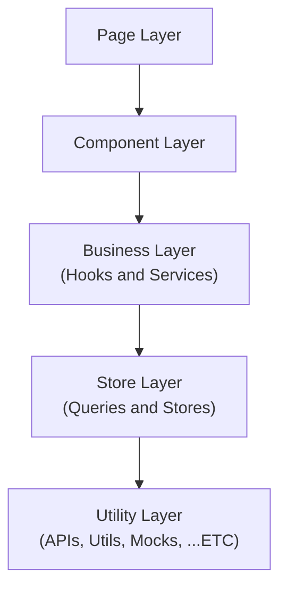

![[29cm-logo.webp]]

> [!info]
> 본 글은 3월에 진행했던 **29CM Frontend Eginner** 전형 과제에 대한 회고입니다. 
> 모든 과제 내용은 **외부 유출이 금지**되어 있기 때문에 공개할 수 없는 점 양해 부탁드립니다.
> 
> 본 회고는 1부, 2부로 나뉘어 작성되었습니다.
> 
> - 1부 - **기술 선정**
> - 2부 - **고민과 후기**

1부에서는 서류 지원과 합격 그리고 과제에 사용할 기술 선정에 대해서 이야기했습니다. 

이번 2부에서는 과제를 진행하면서 고민한 점과 종합적인 후기에 대해서 이야기할 예정입니다.

## 고민
기술 선정 이후 했던 가장 큰 고민은 **"어떻게 하면 프로그램을 잘 만들 수 있을까?"** 였다.

합격을 위해서는 과제에서 요구하는 바를 모두 만족하는 프로그램을 만들어야 한다. 하지만 단순히 요구사항을 만족하는 프로그램을 만드는 것만으로는 합격이 어렵다고 생각했다. 많은 사람들이 원하는 기업인 만큼 뛰어난 사람들이 해당 전형에 지원했을 것이기 때문에 합격을 위해서는 요구사항을 만족할 뿐 아니라 잘 만들어진 프로그램을 제출할 필요가 있다고 생각했다. 

> 그렇다면 잘 만들어진 프로그램(좋은 프로그램)이란 무엇일까?

잘 만들어진 프로그램(좋은 프로그램)을 정의하는 다양한 요소가 있겠지만 지금까지의 경험을 바탕으로 개인적으로 생각하는 가장 중요한 요소는 바로 **유지 보수성**과 **확장성**이다. 그동안 다양한 서비스를 만들어 오며 배운 것이 있다면 바로 상황에 따라 **프로그램은 계속 변경된다**는 것이다. 제작 중에 요구사항이 변경되거나 완성 이후에 새로운 기능이 추가되는 등 프로그램은 항상 상황에 따른 변경 사항을 맞이하게 된다. 이때 잘 만들어진 프로그램(좋은 프로그램)이라면 큰 어려움 없이 새로운 기능을 추가하고 변경할 수 있을 것이다.

따라서 잘 만들어진 프로그램이란 유지 보수와 확장에 용이한 프로그램이라는 생각을 바탕으로 과제를 진행하는데 있어 아래와 같은 원칙과 개발 방법 등을 고민하게 되었다.
 
### SOLID
[이전에 진행했던 프로젝트](https://github.com/effective-tech-interview/effective-tech-interview-client)를 통해 잠시나마 실제로 서비스를 운영해 볼 수 있었다.
    
첫 배포 이후 운영 과정에서 새로운 요구 사항이 발생하였고 이를 만족하기 위해 기존 기능을 변경하고 새로운 기능을 추가할 필요가 있었다. 금방 끝낼 수 있을거라는 처음의 예상과는 달리 생각 이상의 많은 시간이 소요되었다. 무엇이 문제였을까? 당시 만들었던 버튼 컴포넌트의 구현 과정을 잠시 살펴보며 문제점을 알아보자.

> [!info]
> 아래의 링크를 통해 당시 만들었던 Button 컴포넌트의 구현 및 리팩토링 과정을 확인할 수 있다.
> 
> - [feat: button 컴포넌트 구현 #6](https://github.com/effective-tech-interview/effective-tech-interview-client/pull/6)
> - [refactor: button 컴포넌트 리팩토링 #11](https://github.com/effective-tech-interview/effective-tech-interview-client/pull/11)
> - [feat: question button 구현 #64](https://github.com/effective-tech-interview/effective-tech-interview-client/pull/64)

![[first-buton-design.webp|]]

> 초기 버튼 컴포넌트의 디자인

초기 버튼 컴포넌트는 스타일에 따른 구분만 존재할 뿐 역할과 책임에 따른 뚜렷한 구분이 존재하지 않았다. 

따라서 처음에는 아래와 같이 `props`를 통해 디자인을 적용할 수 있는 형태의 버튼 컴포넌트를 만들게 되었다.

```tsx
// Button.tsx
interface ButtonProps extends ComponentProps<'button'> {
  width?: number;
  height?: number;
  color?: KeyOfColors;
  backgroundColor?: KeyOfColors;
}

const Button = ({
  width,
  height,
  color,
  backgroundColor,
  children,
  ...rest
}: PropsWithChildren<ButtonProps>) => {
  return (
    <StyledButton
      width={width}
      height={height}
      color={color}
      backgroundColor={backgroundColor}
      {...rest}
    >
      {children}
    </StyledButton>
  );
};

export default Button;
```

> [src/components/common/Button/Button.tsx](https://github.com/effective-tech-interview/effective-tech-interview-client/blob/0aa0558b02ebf78ef2ba125423bed55303e71ad1/src/components/common/Button/Button.tsx)

이러한 버튼 컴포넌트는 다음과 같은 **문제점**을 가졌다.

현재 버튼 컴포넌트에는 프로젝트의 디자인 시스템이 적용되어 있다. 버튼 컴포넌트는 **도메인**이 적용된 컴포넌트이다. 하지만 도메인에 따른 **역할과 책임**은 배제되어있다. 버튼 컴포넌트의 역햘과 책임은 컴포넌트 자체가 가지는 것이 아닌 컴포넌트를 사용하는 사용자에 의해 결정된다. 

따라서 버튼 컴포넌의 역할과 책임을 이해하기 위해서는 항상 주변 컨텍스트를 이해해야만한다. 이것은 코드의 가독성을 해치고 생산성을 떨어트린다. 

따라서 이러한 문제를 해결하기 위해서는 버튼 컴포넌트가 역할과 책임을 가질 수 있게 만들어야 한다.

> [!info]
> 버튼 컴포넌트 개선에 대한 상세한 내용은 추후에 따로 작성할 예정이다.

위와 같이 버튼 컴포넌트의 개선 과정을 겪으며 컴포넌트의 **역할과 책임**에 대해서 깊게 고민하기 시작했다. 그리고 곧 이러한 고민이 `SRP(Single Responsibility Principle)`와 닮아있다는 것을 알게 되었다. SRP에 대해 고민하기 시작하면서 자연스럽게 `SOLID` 원칙에 대해 찾아보았다.

아래의 글들을 통해 `SOLID`, 프론트엔드에서의 `SOLID`에 대해 이해할 수 있었다.

> [!tip]
> - [프론트엔드와 SOLID 원칙](https://fe-developers.kakaoent.com/2023/230330-frontend-solid/)
> - [[번역] 그림으로 보는 SOLID 원칙](https://blog.siner.io/2020/06/18/solid-principles/)
> - [프론트엔드에 SOLID 적용하기](https://kooku0.github.io/blog/%ED%94%84%EB%A1%A0%ED%8A%B8%EC%97%94%EB%93%9C%EC%97%90-solid-%EC%A0%81%EC%9A%A9%ED%95%98%EA%B8%B0/)

과제를 진행하며 모든 원칙을 만족시킬 수는 없었지만 적어도 `SRP(Single Responsibility Principle)`를 충실히 따르기 위해 노력했다. 아래는 SRP를 지키기위해 가장 먼저 고민했던 프로젝트의 폴더 구조이다. 

> [!info]
>  과제의 내용이 노출될 수 있는 부분은 **domain**으로 표현하였습니다.

```zsh
📦src  
 ┣ 📂apis  
 ┣ 📂app  
 ┣ 📂components    
 ┃ ┣ 📂domain01  
 ┃ ┣ 📂domain02  
 ┃ ┣ 📂domain03
 ┃ ┣ 📂provider  
 ┃ ┗ 📂ui  
 ┣ 📂hooks  
 ┣ 📂mocks  
 ┣ 📂queries  
 ┣ 📂services   
 ┣ 📂stores    
 ┣ 📂styles  
 ┣ 📂types  
 ┗ 📂utils  
```

각각의 폴더는 다음과 같은 역할과 책임을 가진다.

- **apis**: `Axios`를 이용한 데이터 패칭과 관련된 파일을 모아 놓은 디렉토리
- **app**: 어플리케이션의 `Page`를 모아 놓은 디렉토리, `Next`의 App Router 사용시 페이지를 구현하기 위해 app 디렉토리를 사용해야만 한다. 
- **components**: 어플리케이션에서 사용하는 모든 컴포넌트를 모아 놓은 디렉토리. 도메인에 구애 받지 않는 UI 컴포넌트는 UI 폴더에, 도메인과 관련된 컴포넌트는 따로 적절한 도메인 폴더에 모아 놓는다.
- **hooks**: 어플리케이션의 비지니스 로직 중 `custom hook`을 모아 놓은 디렉토리
- **mocks**: `MSW`를 이용한 mock 서버와 관련된 파일을 모아 놓은 디렉토리
- **queries**: 서버 상태 관리를 위한 `React-Query`와 관련된 파일을 모아 놓은 디렉토리
- **services**: 어플리케이션의 비지니스 로직 중 hook이 아닌 파일을 모아 놓은 디렉토리
- **stores**: 전역 상태 관리를 위한 `Zustand`와 관련된 파일을 모아 놓은 디렉토리
- **styles**: 스타일과 관련된 파일을 모아 놓은 디렉토리
- **types**: 전역 혹은 중복으로 사용되는 타입을 모아 놓은 디렉토리
- **utils**: 유틸 함수를 모아 놓은 디렉토리

### Layered Architecture
위와 같은 폴더 구조를 구성한 이유에는 `SRP(Single Responsibility Principle)`를 따르기 위함 뿐 아니라 `Layered Architecture`와도 연관이 있다. 

처음 `Layered Architecture`에 관심을 가지게 된 계기는 함수형 프로그래밍을 공부하기 시작하면서부터였다. 당시 [쏙쏙 돌아오는 함수형 코딩](https://product.kyobobook.co.kr/detail/S000001952246)이라는 책을 통해 함수형 프로그래밍에 대해 공부하고 있었는데 여기서 계층형 설계 파트를 통해 소프트웨어를 계층으로 구성하는 `Layered Architecture`에 대해 알게되었다.

이후 다음의 글들을 통해 `Layer Architecture`에 대한 이해를 높일 수 있었다.

> [!info]
> - [계층형 아키텍처](https://jojoldu.tistory.com/603)
> - [쉽게 말하는, 계층형 아키텍처의 문제](https://velog.io/@jay/%EC%89%BD%EA%B2%8C-%EB%A7%90%ED%95%98%EB%8A%94-%EA%B3%84%EC%B8%B5%ED%98%95-%EC%95%84%ED%82%A4%ED%85%8D%EC%B2%98%EC%9D%98-%EB%AC%B8%EC%A0%9C)

`Layered Architecture`를 통해 계층화를 하게 되면 **관심사를 분리**할 수 있을 뿐 아니라 각 **모듈 교체**와 **테스트**에서 이점을 가질 수 있다. 이러한 특징 덕분에 `Layered Architecture`를 사용하는 것이 유지 보수와 확장성에서 이점을 가질 수 있다고 생각하였고, 다음과 같은 계층을 구성하게 되었다.



> 계층 구성에는 다음의 자료를 참고하였다.

> [!info]
> - [프론트엔드 상태관리 실전 편 with React Query & Zustand [#우아콘2023]](https://youtu.be/nkXIpGjVxWU?si=Imt-rjOH4FVZLJHA)

`Business Layer`에서 `Utility Layer`를 참조하거나 `Component Layer`에서 `Store Layer`를 참조하는 등 `Opened Layer`를 만들어 완벽히 `Layered Architecture`를 따르지는 못했지만 계층을 구성하고 각 계층에 맞는 적절한 함수의 위치를 고민하면서 함수가 가지는 역할과 책임에 대해 더욱 깊게 고민할 수 있게되었다. 

### CDD (Component-Driven Development)
계층형 설계를 통해 프로젝트의 구조를 구성한 이후 어떻게 컴포넌트를 개발할 것인지 생각해보았다.

평소 컴포넌트를 개발할 때 주로 바텀-업 방식을 이용한다. 이러한 바텀-업 방식은 점진적으로 결합(조립) 하여 컴포넌트를 개발하기 때문에 관심사를 분리하고 작은 단위의 테스트하기 용이한 컴포넌트를 만들 수 있게 해준다.

![[cdd-gif.gif]]

[Storybook](https://storybook.js.org/)을 이용하면 이러한 바텀-업 방식의 개발 방법을 적용하여 독립적으로 컴포넌트를 구성할 수 있을 뿐 아니라 자연스럽게 **CDD(Component-Driven Development)** 를 적용할 수 있게 된다. CDD를 통해 각 컴포넌트의 역할과 책임에 대해 고민하고 결과적으로 더 나은 컴포넌트를 설계할 수 있게 되었다.

> [!info]
> - [Component-Driven Development | Build UIs in a better way: from the component up](https://www.chromatic.com/blog/component-driven-development/)

각 컴포넌트에 대한 story를 만드는데에는 보일러플레이트가 필요했기 때문에 [코드 스닛펫(code snippets)](https://code.visualstudio.com/docs/editor/userdefinedsnippets)을 이용하여 스토리북 작성의 효율성을 높였다.

```json
{
	"storybook-template": {
		"prefix": "sbtemplate", 
		"scope": "typescriptreact",
		"body": [
			"import type { Meta, StoryObj } from '@storybook/react';",
			"",
			"import { ${2:${TM_FILENAME_BASE/(.*)(.stories)/${1:/pascalcase}/gi}} } from './${1:${TM_FILENAME_BASE/(.*)(.stories)/${1:/pascalcase}/gi}}';",

			"",
			"const meta: Meta<typeof ${1:${TM_FILENAME_BASE/(.*)(.stories)/${1:/pascalcase}/gi}}> = {",
			"  title: '${1:${TM_FILENAME_BASE/(.*)(.stories)/${1:/pascalcase}/gi}}',",
			"  component: ${1:${TM_FILENAME_BASE/(.*)(.stories)/${1:/pascalcase}/gi}},",
			"};",
			"",
			"export default meta;",
			"",
			"type Story = StoryObj<typeof ${1:${TM_FILENAME_BASE/(.*)(.stories)/${1:/pascalcase}/gi}}>;",
			"",
			"export const Default: Story = {",
			"  args: {}",
			"};",
			""
		],
		"description": "Creates a Storybook story template based on the filename."
	}
}
```

### 선언형 프로그래밍 (Declarative Programming)
코드가 어떻게 동작해야하는지에 대해 설명하는 **명령형 프로그래밍(Imperative Programming)** 과 대비되는 개념인 **선언형 프로그래밍(Declarative Programming)** 은 어떻게(How)가 아닌 무엇(What) 인지에 초점을 맞춘 프로그래밍 방식으로 추상화 수준을 높여 전체적인 코드의 가독성을 높이

### TDD (Test-Driven Development)


## 문제 해결

## 아쉬웠던 부분

기존에 사용하지 않았던 많은 기술들을 단시간에 학습하고 적용하려다보니 2일차가 되어서야 본격적으로 과제를 진행할 수 있었다. 또한 Next 14를 사용하면서 많은 버그들에 부딪혔고 이를 해결하는데 많은 시간을 소비해야만 했다. 

TDD