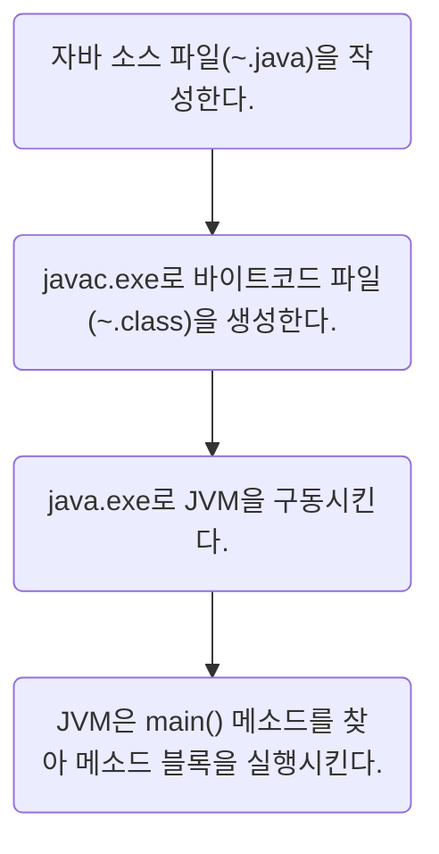

1. 자바 언어의 특징을 잘못 설명한 것은 무엇입니까?
	(4) 개발자가 코드로 메모리를 관리해야 한다.	

> [!info]
> 자바는 메모리를 자동으로 관리해주기 때문에 개발자가 따로 관리할 필요가 없다.

2. Open JDK와 Oracle JDK를 잘못 설명한 것은 무엇입니까?
	(2) Oracle JDK는 개발 소스 공개 의무가 없지만, Open JDK는 있다.

> [!info]
> Oracle JDK, Open JDK 둘 다 개발 소스 공개 의무는 없다.

3. 환경 변수에 대해 잘못 설명한 것은 무엇입니까?
	(4) 환경 변수를 수정하면 기존 명령 프롬프트 또는 터미널에서 바로 적용된다.

> [!info]
> Mac에서 `source`와 같은 별도의 적용 과정이 필요하다.

4. 자바 가상 머신(JVM)에 대해 잘못 설명한 것은 무엇입니까?
	(3) JVM은 운영체제에 독립적이다(운영체제별로 동일한 JVM이 사용된다).

> [!info]
> JVM은 운영체제에 의존적이며, 바이트코드를 운영체제에 맞는 기계어로 바꾸어준다.

5. 자바 프로그램 개발 과정을 순서대로 적어보세요.

6. 자바 소스 파일을 작성할 때 잘못된 것은 무엇입니까?
	(4) 주석은 문자열 안에도 작성할 수 있다.

7. 이클립스의 특징을 올바르게 설명한 것을 모두 선택하세요.

8. 다음과 같이 출력되도록 Example.java를 패키지 ch01.verify에 작성해보세요.

